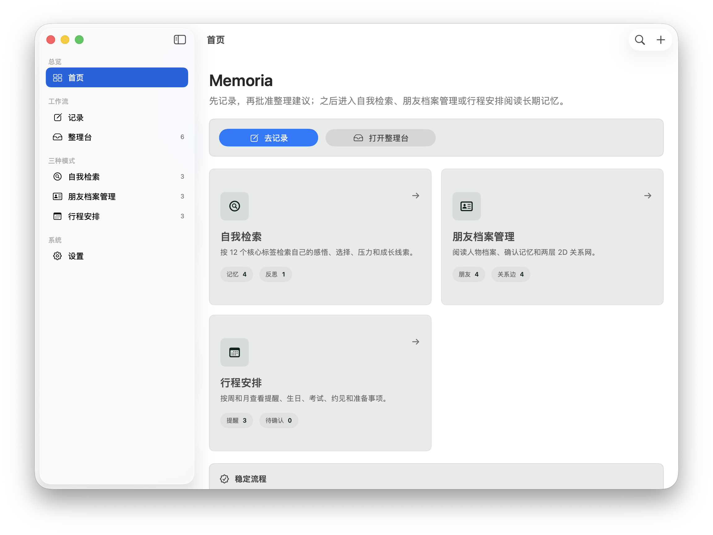
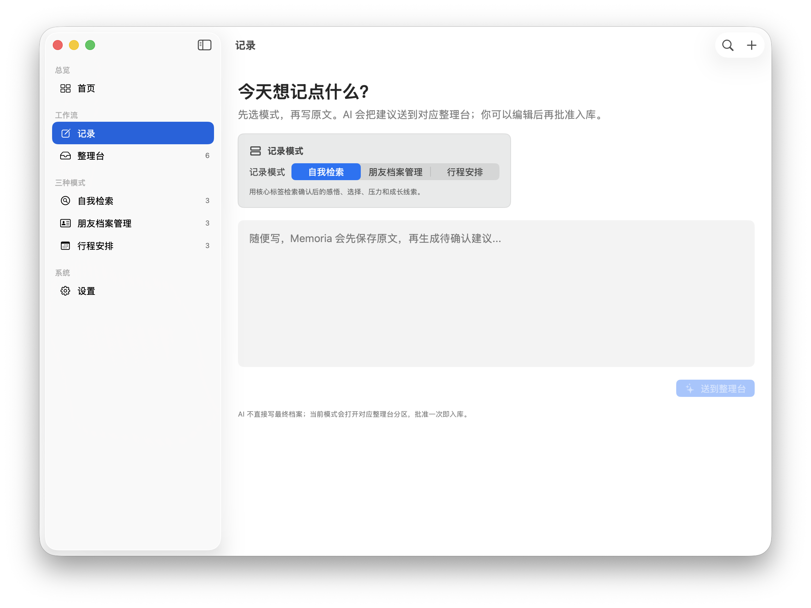
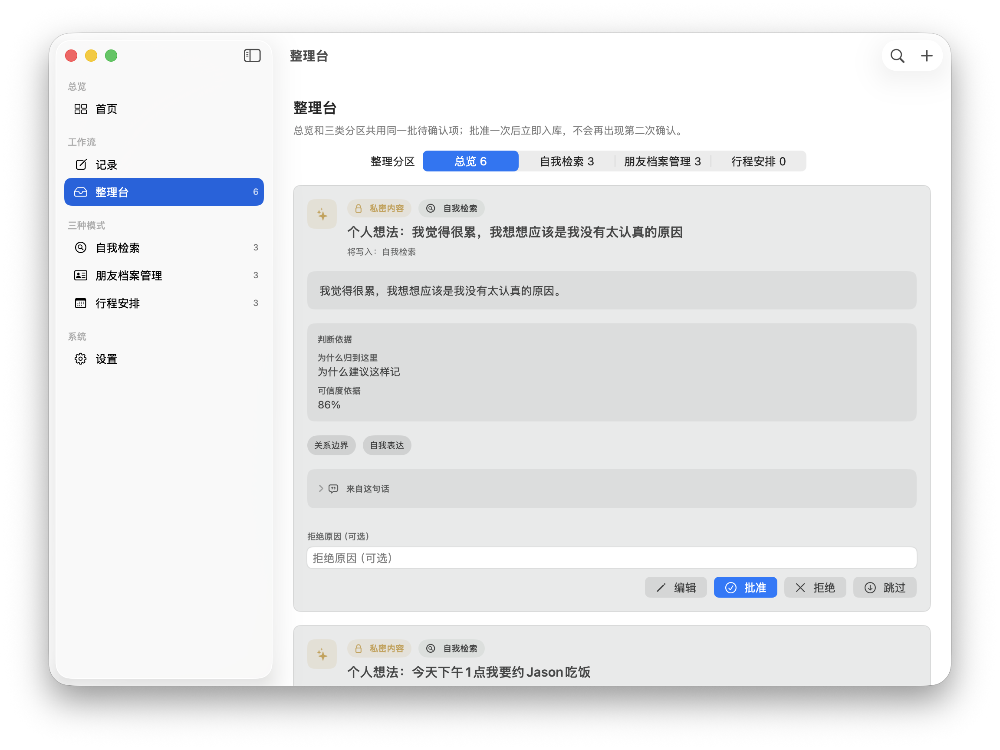
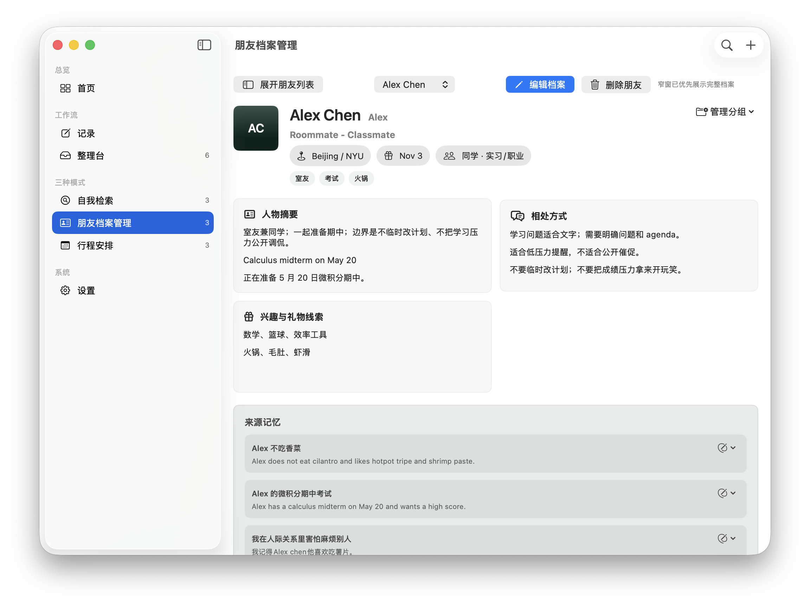
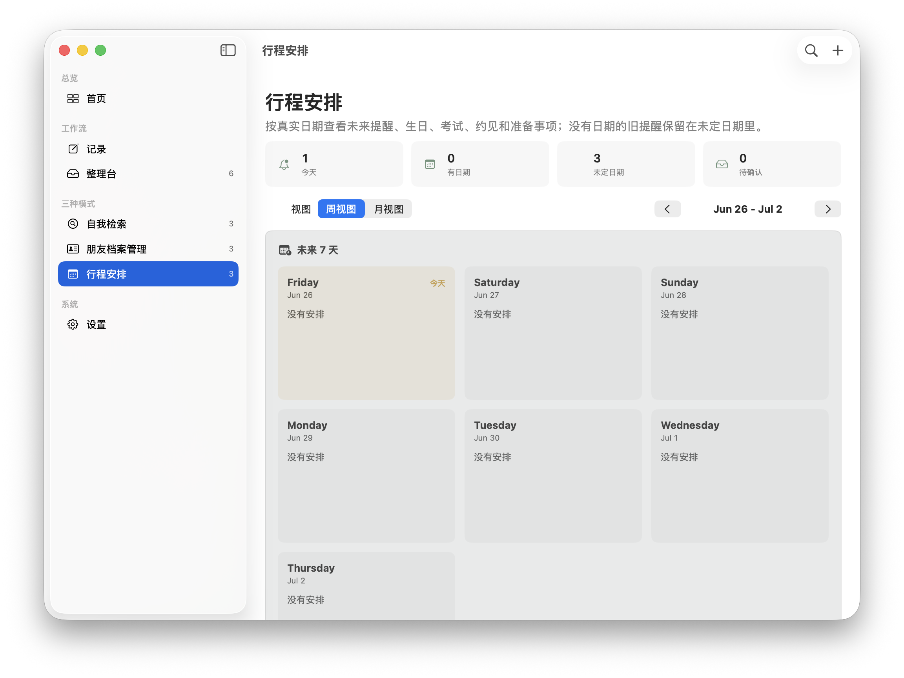

# Memoria

**中文**：Memoria 是一个 macOS 优先的私人 AI 关系记忆应用，帮助学生和年轻创作者记录、整理和检索“重要的人”的信息。当前仓库把 Web 端作为视觉/API 参考，正在优先交付本地优先的 macOS 版本。

**English**: Memoria is a macOS-first private AI memory app for the people who matter. It helps students and young builders capture, organize, and retrieve relationship context. The web app in this repository is a visual/API reference while the active delivery target is the local-first macOS app.

## Download / 下载

**中文**：最新 macOS 预览版可以在 GitHub Releases 下载：

- [Latest release](https://github.com/Cis-jujube/Memoria/releases/latest)
- [Memoria-macOS-arm64.dmg](https://github.com/Cis-jujube/Memoria/releases/latest/download/Memoria-macOS-arm64.dmg)
- [Memoria-macOS-arm64.zip](https://github.com/Cis-jujube/Memoria/releases/latest/download/Memoria-macOS-arm64.zip)

**English**: The latest macOS preview build is available from GitHub Releases:

- [Latest release](https://github.com/Cis-jujube/Memoria/releases/latest)
- [Memoria-macOS-arm64.dmg](https://github.com/Cis-jujube/Memoria/releases/latest/download/Memoria-macOS-arm64.dmg)
- [Memoria-macOS-arm64.zip](https://github.com/Cis-jujube/Memoria/releases/latest/download/Memoria-macOS-arm64.zip)

## Install On Mac / Mac 安装

**中文**：

1. 下载 `Memoria-macOS-arm64.dmg`，打开后把 `Memorial.app` 拖到 Applications。
2. 或下载 `Memoria-macOS-arm64.zip`，解压后打开 `Memorial.app`。
3. 当前预览版使用 ad-hoc 签名，尚未 Apple notarization。如果 macOS Gatekeeper 阻止首次打开，请右键点击 `Memorial.app`，选择 `Open`，再确认打开。
4. 系统要求：Apple Silicon Mac，macOS 14 或更新版本。

**English**:

1. Download `Memoria-macOS-arm64.dmg`, open it, and drag `Memorial.app` into Applications.
2. Or download `Memoria-macOS-arm64.zip`, unzip it, and open `Memorial.app`.
3. This preview build is ad-hoc signed and not yet Apple-notarized. If macOS Gatekeeper blocks the first launch, right-click `Memorial.app`, choose `Open`, then confirm.
4. Requirements: Apple Silicon Mac, macOS 14 or later.

## What It Does / 功能定位

**中文**：Memoria 的核心循环是“记录 -> 整理台 -> 确认更新”。你可以记录自我检索、朋友档案管理和行程安排相关信息；AI 会把原始记录整理成待确认的更新，只有用户确认后才会写入记忆、档案或提醒。

**English**: Memoria's core loop is "Capture -> Review Desk -> Confirmed Update." You can capture notes for self retrieval, friend profile management, and scheduling. AI turns raw entries into pending updates, and nothing is committed to memory, profiles, or reminders until the user confirms it.

## Product Walkthrough / 功能图解

Screenshots below are from the current macOS preview with demo data.

下面截图来自当前 macOS 预览版和内置 demo 数据。

### 1. Home Dashboard / 首页总览



**中文**：首页把 Memoria 的使用路径直接摆出来：先进入 `记录` 写原文，再到 `整理台` 批准 AI 生成的整理建议，最后分别进入 `自我检索`、`朋友档案管理` 或 `行程安排` 阅读长期记忆。左侧边栏固定为四组：总览、工作流、三种模式和系统，避免把“记录入口”和“长期阅读入口”混在一起。

**English**: The home dashboard makes the product loop explicit: capture a raw note, approve AI-generated proposals in the Review Desk, then read the confirmed memory through Self Search, Friend Dossiers, or Schedule. The sidebar separates workflow entry points from long-term reading surfaces.

### 2. Capture / 记录



**中文**：记录页先让用户选择模式，再写原文。模式不是装饰：`自我检索` 会把内容送到自我记忆分区，`朋友档案管理` 会优先抽取朋友事实、偏好、关系和礼物线索，`行程安排` 会优先处理提醒、deadline、约见和重复事项。AI 不直接写最终档案；原文会先保存成本地 `RawEntry`，再生成可审核的 `PendingUpdate`。

**English**: Capture starts with a mode choice before the user writes the source note. The mode controls routing: self memory, friend/profile facts, or schedule-related proposals. AI never writes final records directly; the source note is saved locally first, then converted into reviewable pending updates.

### 3. Review Desk / 整理台



**中文**：整理台是安全边界。它按 `总览`、`自我检索`、`朋友档案管理`、`行程安排` 分区展示同一批待确认项，每张卡都会保留来源句子、判断依据、置信度、写入位置和操作按钮。用户可以编辑、批准、拒绝或跳过；批准一次后才会真正写入本地记忆、朋友档案、提醒或关系边，不会再出现第二次隐式确认。

**English**: The Review Desk is the safety boundary. It shows pending proposals by overview and category, preserving the source quote, rationale, confidence, destination, and actions. The user can edit, approve, reject, or skip. Only approval commits data into local memory, friend profiles, reminders, or relationship edges.

### 4. Friend Dossier Management / 朋友档案管理



**中文**：朋友档案不是普通通讯录。每个人有摘要、相处方式、兴趣与礼物线索、来源记忆、分组和可编辑档案字段。AI 可以提出“Alex 不吃香菜”“May 想试拍立得”这类结构化更新，但必须先经过整理台批准；用户也可以手动编辑档案、删除朋友、调整分组和管理关系边。

**English**: Friend Dossiers are more than contacts. Each person has a summary, interaction style, preferences, gift signals, source memories, groups, and editable profile fields. AI may suggest structured updates, but profile changes still require Review Desk approval.

### 5. Schedule / 行程安排



**中文**：行程页按天、周、月查看提醒、生日、考试、约见、准备事项和未定日期任务。Memoria 会区分“事件时间”和“提醒触发时间”：例如“15:00 开会，14:30 提醒我”可以成为可执行提醒；但“下午约饭”这种模糊时间会留在整理台，要求用户补充具体时间和提醒策略。

**English**: Schedule organizes reminders, birthdays, exams, meetings, preparation tasks, and undated items by day, week, or month. Memoria separates event time from reminder trigger time, and keeps ambiguous schedule candidates in review until the user confirms the missing details.

## Core Capabilities / 核心能力

**中文**：

- 本地优先：关系数据、原始记录、已确认记忆和提醒保存在 macOS 本地 SQLite。
- 自然语言记录：用户可以随手写中文或英文原文，不需要先填表。
- AI 整理但不越权：AI 只生成 `PendingUpdate`，不会绕过用户批准直接改档案。
- 三种模式：自我检索、朋友档案管理、行程安排分别服务长期反思、人际资料和可执行事务。
- 来源可追溯：整理台保留 `source_quote`、分类依据、置信度和写入目标。
- 朋友档案：支持人物摘要、偏好、边界、兴趣、礼物线索、分组和关系边。
- 行程协议：区分 task、event、deadline、recurring、取消/改期和 contextual guard，缺时间或提醒策略时不会创建可执行提醒。
- 安全存储：DeepSeek API key 只保存在 Keychain，不写入 SQLite、日志、fixture 或发布产物。

**English**:

- Local-first storage for people, raw entries, confirmed memories, and reminders.
- Natural-language capture in Chinese or English without forcing form-first input.
- AI-assisted organization through reviewable `PendingUpdate` proposals only.
- Three durable modes: Self Search, Friend Dossier Management, and Schedule.
- Source-backed review cards with quotes, rationale, confidence, and destination.
- Friend profiles with summaries, preferences, boundaries, interests, gift signals, groups, and relationship edges.
- Schedule protocol for tasks, events, deadlines, recurring items, mutations, and contextual guards.
- Keychain-only DeepSeek API key storage for the native app.

## Privacy Model / 隐私模型

**中文**：

- macOS 版本把关系数据、原始记录、已确认记忆和提醒保存在本地 SQLite。
- DeepSeek API key 由用户在 Settings 中输入，并保存在 macOS Keychain。
- API key 不应写入 SQLite、源码、文档、fixture、日志或 Release 产物。
- AI 只能生成 `PendingUpdate` 提案；确认、丢弃和最终写入由用户控制。

**English**:

- The macOS app stores relationship data, raw entries, confirmed memories, and reminders in local SQLite.
- The user's DeepSeek API key is entered in Settings and stored in macOS Keychain.
- API keys must not be written to SQLite, source code, docs, fixtures, logs, or release artifacts.
- AI can create `PendingUpdate` proposals only; confirmation, discard, and final writes remain user-controlled.

## Current Stack / 当前技术栈

**中文**：

- macOS SwiftUI 原生客户端，使用 SQLite3 和 Keychain。
- Next.js App Router + TypeScript + Tailwind CSS 作为 Web 参考界面。
- DeepSeek Chat Completions JSON 输出，使用用户自己的 API key。
- Vitest + Testing Library 覆盖 Web/reference 行为。
- SwiftPM `MemoriaProtocolChecks` 覆盖 macOS 记忆协议路径。

**English**:

- Native macOS SwiftUI app using SQLite3 and Keychain.
- Next.js App Router + TypeScript + Tailwind CSS as the web reference UI.
- DeepSeek Chat Completions JSON output with user-owned API keys.
- Vitest + Testing Library for web/reference behavior.
- SwiftPM `MemoriaProtocolChecks` for the macOS memory protocol path.

## Repository Layout / 仓库结构

**中文**：

- `macos/`：当前主要交付目标，包含 SwiftUI app、SQLite 持久化和协议检查。
- `src/`：Next.js 参考 UI、API 和共享 TypeScript 逻辑。
- `docs/`：产品范围、记忆协议、设计系统和本地 QA 文档。
- `script/`：本地运行、验证和发布打包脚本。
- `ios/`、`android/`、`windows/`：兼容目标和后续平台参考。

**English**:

- `macos/`: active delivery target with the SwiftUI app, SQLite persistence, and protocol checks.
- `src/`: Next.js reference UI, APIs, and shared TypeScript logic.
- `docs/`: product scope, memory protocol, design system, and local QA docs.
- `script/`: local run, verification, and release packaging scripts.
- `ios/`, `android/`, `windows/`: compatibility targets and future platform references.

## Local Development / 本地开发

**中文**：本仓库使用 pnpm 管理 Web/reference 依赖。原生 macOS App 使用 SwiftPM。

```bash
pnpm install
cp .env.example .env.local
pnpm prisma:generate
pnpm dev
```

**English**: This repository uses pnpm for web/reference dependencies. The native macOS app uses SwiftPM.

```bash
pnpm install
cp .env.example .env.local
pnpm prisma:generate
pnpm dev
```

Required production variables for the web/reference server:

```text
DATABASE_URL
NEXTAUTH_URL
NEXTAUTH_SECRET
AUTH_SECRET
GOOGLE_CLIENT_ID
GOOGLE_CLIENT_SECRET
OPENAI_API_KEY
OPENAI_MODEL
AI_PROVIDER
DEEPSEEK_API_KEY
DEEPSEEK_MODEL
DEEPSEEK_BASE_URL
BLOB_READ_WRITE_TOKEN
UPLOAD_MAX_BYTES
UPLOAD_MAX_REQUEST_BYTES
UPLOAD_RATE_LIMIT_PER_HOUR
SENDGRID_API_KEY
SENDGRID_FROM_EMAIL
CRON_SECRET
```

**中文**：原生客户端不通过 `.env` 读取 DeepSeek key；用户需要在各平台 app 的 Settings 中输入自己的 key。

**English**: Native clients do not read DeepSeek keys from `.env`; users enter their own key inside each app's Settings screen.

## Run And Verify macOS / 运行与验证 macOS

**中文**：从仓库根目录运行：

```bash
bash ./script/build_and_run.sh
```

验证记忆协议和 Swift 构建：

```bash
cd macos
swift run MemoriaProtocolChecks
swift build
cd ..
bash ./script/build_and_run.sh --verify
```

**English**: From the repository root:

```bash
bash ./script/build_and_run.sh
```

Verify the memory protocol and Swift build:

```bash
cd macos
swift run MemoriaProtocolChecks
swift build
cd ..
bash ./script/build_and_run.sh --verify
```

## Web Checks / Web 检查

```bash
pnpm lint
pnpm typecheck
pnpm test
pnpm build
```

## Build Release Artifacts / 构建发布产物

**中文**：生成 macOS Release 附件：

```bash
bash ./script/package_macos_release.sh
```

输出文件：

- `dist/Memorial.app`
- `dist/Memoria-macOS-arm64.zip`
- `dist/Memoria-macOS-arm64.dmg`
- `dist/SHA256SUMS.txt`
- `dist/release-notes-v0.1.0.md`

**English**: Generate macOS release assets:

```bash
bash ./script/package_macos_release.sh
```

Outputs:

- `dist/Memorial.app`
- `dist/Memoria-macOS-arm64.zip`
- `dist/Memoria-macOS-arm64.dmg`
- `dist/SHA256SUMS.txt`
- `dist/release-notes-v0.1.0.md`

## Release Status / 发布状态

**中文**：当前版本是 macOS preview。Web 端仍是参考实现；iOS、Android 和 Windows 是兼容目标，不是本阶段的正式交付重点。

**English**: The current version is a macOS preview. The web app remains a reference implementation; iOS, Android, and Windows are compatibility targets rather than the primary delivery focus for this phase.
