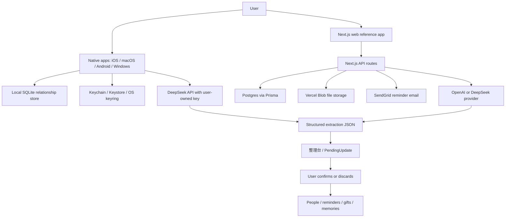
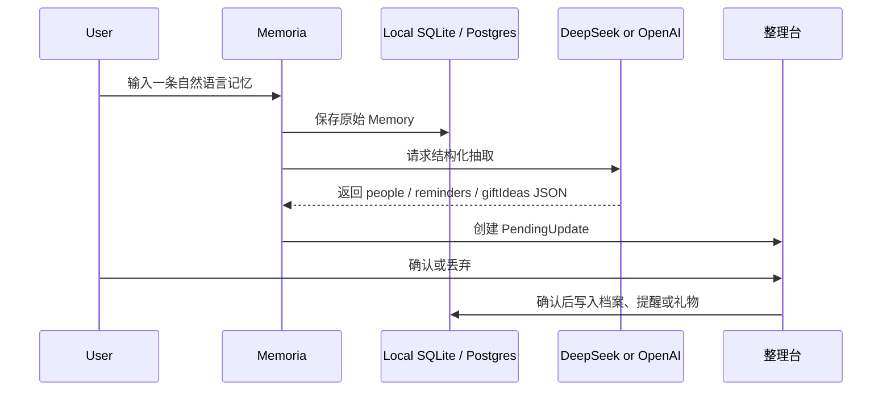

# Memoria 项目总览

## 一句话介绍

Memoria 是一个面向学生和年轻人的私密 AI 关系记忆工具。它帮助用户记录朋友、同学、室友、实习同事等重要关系中的细节，并把自然语言记录、文件导入、提醒、礼物灵感和关系维护建议整理成一个可确认、可追溯、默认私密的个人关系记忆系统。

项目当前的产品方向是 **native / local-first**：Web 应用作为视觉和交互参考，真正的产品运行时优先转向 iOS、macOS、Android 和 Windows 本地应用。本地端使用 SQLite 保存关系数据，使用系统安全存储保存用户自己的 DeepSeek API key，AI 识别结果必须先进入 整理台 / 待确认，不能直接改写朋友档案。

## 项目要解决的问题

很多关系维护并不是缺少热情，而是缺少可被想起的上下文：

- 朋友的生日、忌口、爱好、最近考试、面试、旅行、实习状态很容易忘。
- 聊天记录和生活片段是零散的，难以沉淀为结构化记忆。
- AI 可以帮忙整理，但如果自动写入档案，会带来误判、隐私和信任问题。
- 对学生和年轻人来说，关系网络跨越同学、社团、家乡朋友、留学圈、实习圈，需要轻量但细致的管理方式。

Memoria 的核心判断是：AI 不应该替用户决定“这个人是什么样的人”，而应该提出有证据的建议，让用户确认后再写入。

## 核心产品机制

### 1. 记录：三种模式入口

用户可以用自然语言记录一段关系信息，例如：

> Alex 下周有微积分期中，他不吃香菜，最近想找后端实习。

macOS 当前把记录入口显性分成三种单选模式：

- 自我检索：记录自己的反思、压力、判断、灵感和成长线索。
- 朋友档案管理：记录朋友事实、偏好、关系上下文和礼物线索。
- 行程安排：记录提醒、生日、考试、面试、旅行、约见和准备事项。

系统会先保存原始 RawEntry，再调用 AI 抽取结构化信息。

### 2. 整理台 / 待确认

AI 抽取出的内容不会直接改写档案，而是变成 PendingUpdate：

- 资料事实：专业、公司、所在地、最近状态。
- 偏好：喜欢吃什么、不喜欢什么、游戏、音乐、书、运动。
- 提醒：考试、生日、面试、旅行、搬家等时间点。
- 礼物灵感：基于喜好和证据生成备选建议。
- 文件笔记：从导入文件中提取的待确认信息。

用户可以在整理台总览或对应模式分区里逐条确认或丢弃。确认后才会写入人物档案、提醒、礼物清单或确认后的记忆。

### 3. 朋友档案和分组

人物档案包含：

- 基本关系标签和分组。
- 生日、地点、学校或公司、专业或角色。
- 饮食限制、喜欢的食物、不喜欢的东西。
- 兴趣、书、运动、游戏、音乐和媒体偏好。
- 学习、职业、生活、旅行、关系边界和沟通风格。

分组支持同学、老朋友、实习圈、海外学习等关系场景，也支持用户自定义分组。

### 4. 今日简报、提醒和礼物灵感

Dashboard 会把近期需要注意的事集中呈现：

- 待确认的信息。
- 即将到期的提醒。
- 生日和重要节点。
- 礼物机会。
- 每个人的下一步行动建议。

这让应用不是一个静态通讯录，而是一个关系维护 command center。

### 5. 自我检索、记忆搜索和关系图

Web 参考应用中已经实现：

- 基于保存的人物和记忆的搜索。
- 关系健康分数和解释。
- 按分组、提醒、礼物、资料完整度等信号推导下一步建议。
- Three.js 关系星图，用视觉方式表达用户和不同关系节点的距离、强度和提醒状态。

macOS 当前把一级模式收敛为自我检索、朋友档案管理和行程安排；关系图能力保留在朋友档案和相关视图里，不作为本轮独立审批入口。

## 当前已经做到什么程度

### Web 参考应用

Web 端是一个完整的 Next.js 参考实现，主要用于展示交互、验证业务逻辑和保留后端 API 能力。

已经包括：

- Next.js App Router 页面。
- Quiet Premium 风格的私密关系 command center UI。
- 登录状态和预览模式。
- Email/password 注册登录。
- 可选 Google OAuth。
- 朋友档案、分组、AI Inbox、关系日历、提醒、礼物、搜索、关系星图、文件导入、设置等主要页面。
- API 路由覆盖 capture、AI extract、pending update review、groups、people、calendar、reminders、gifts、relationship graph、file upload、cron parsing、reminder email。
- Prisma + Postgres 数据模型。
- Vercel Blob 文件上传。
- SendGrid 提醒邮件。
- Vitest 单元测试覆盖核心业务模块。

但当前 README 已经明确：Web 不是这一轮的最终产品运行时，而是视觉和交互参考。

### Native / local-first 应用

项目已经开始把 Memoria 转向本地优先的跨平台原生产品。

已有平台：

- macOS：SwiftUI + SQLite + Keychain，包含可运行的 MemoriaMac。
- iOS：SwiftUI 包和应用源文件，目标是 iOS 17+。
- Android：Java 原生 Android 应用，SQLiteOpenHelper + Android Keystore 加密偏好。
- Windows：Tauri + React/TypeScript + Rust，rusqlite + OS keyring / Windows Credential Manager。

本地端共同边界：

- 关系数据保存在本地 SQLite。
- DeepSeek API key 只保存在系统安全存储，不写入 SQLite。
- 用户在 Settings 中输入自己的 DeepSeek API key。
- AI 识别结果进入整理台 / 待确认，确认后才修改数据。
- 支持中文、英文和跟随系统语言。

macOS 当前最显性的产品结构是：侧边栏总览、工作流、三种模式和系统；工作流里有记录和整理台；三种模式是自我检索、朋友档案管理和行程安排。

### 已知限制

当前项目还不是最终商店发布状态：

- iOS 需要完整 Xcode App target 和 Simulator / 真机 QA。
- Android 结构已存在，但当前网络下 Maven/Gradle 依赖下载可能遇到 403，需要 Android Studio 或可访问 Maven 的网络完成 assemble。
- Windows Tauri 可以构建前端包，但最终 `.msi` / `.exe` 打包、签名和 Windows 机器验证还没完成。
- Web API 仍保留了云端 Auth、Postgres、Blob、SendGrid 能力，但 native V1 不依赖这些作为主要产品运行时。
- 文件 OCR、PDF 深度解析和跨设备冲突合并仍属于后续范围。

## 技术架构



## Web 技术栈

| 层级 | 技术 |
| --- | --- |
| Framework | Next.js 16 App Router |
| Language | TypeScript |
| UI | React 19, Tailwind CSS, lucide-react |
| 3D visualization | Three.js |
| Auth | NextAuth / Auth.js, Credentials Provider, optional Google OAuth |
| Database | Prisma 7, Postgres |
| File storage | Vercel Blob |
| Email | SendGrid |
| AI | OpenAI SDK, OpenAI Responses API, DeepSeek OpenAI-compatible Chat Completions |
| Validation | Zod |
| Tests | Vitest, Testing Library |
| Package manager | pnpm workspace |

## Native 技术栈

| Platform | UI / App stack | Local data | Secret storage |
| --- | --- | --- | --- |
| iOS | SwiftUI | SQLite3 | Keychain |
| macOS | SwiftUI / SwiftPM executable | SQLite3 | Keychain |
| Android | Java native views | SQLiteOpenHelper | Android Keystore encrypted preferences |
| Windows | Tauri + React + TypeScript + Rust | rusqlite | OS keyring / Windows Credential Manager |

## 数据模型

Web 参考后端的 Prisma schema 已经覆盖主要实体：

- User：用户账号。
- Person：朋友 / 关系对象档案。
- ContactGroup 和 PersonGroup：分组和成员关系。
- Memory：原始记忆记录。
- PendingUpdate：AI 建议的待确认结构化更新。
- Reminder：提醒。
- GiftIdea：礼物灵感。
- UploadedFile：上传文件和解析状态。
- RelationshipEdge：关系图边。
- AIJob：后台 AI / 文件解析任务。
- AuditEvent：关键操作审计事件。

关键设计点是 Memory 和 PendingUpdate 分离：

- Memory 保存原始事实来源。
- PendingUpdate 保存 AI 建议、证据、置信度和目标字段。
- 只有用户确认 PendingUpdate 后，才会产生真实的资料、提醒或礼物写入。

## 主要业务流程

### 自然语言记录流程



### 文件导入流程

Web 参考应用支持文件上传和异步解析：

1. 上传接口校验登录态、文件大小、文件类型、用户归属和频率限制。
2. 文件进入 Vercel Blob 私有存储。
3. 数据库创建 UploadedFile 和 AIJob。
4. Cron 路由领取 `FILE_PARSE` 队列。
5. 对 JSON、Markdown、CSV、纯文本做受限文本解析。
6. 解析结果创建 Memory 和 `FILE_NOTE` PendingUpdate。
7. PDF 和图片 OCR 目前还没有作为 V1 解析能力完成。

## 安全和隐私设计

项目里最重要的安全边界包括：

- 不在源码、文档、日志或快照中硬编码 API key。
- Native 端 DeepSeek API key 由用户自带，只存在本机系统安全存储。
- Native SQLite 不保存 API key。
- Web 端服务密钥只通过环境变量读取，不能暴露成 `NEXT_PUBLIC_`。
- 所有需要用户数据的 API 通过当前登录用户校验。
- `personId`、`groupId` 等资源操作会做 owner check，避免越权访问。
- 文件上传有大小、类型、扩展名、请求体和频率限制。
- 文件解析不在上传请求中同步执行，而是进入受控后台任务。
- AI 抽取结果必须经过 Zod schema 校验。
- AI 建议先进入 PendingUpdate，不直接修改用户资料。
- 关键事件写入 AuditEvent，便于追踪。

## 仓库结构

```text
.
├── src/                    # Next.js web reference app
│   ├── app/                # App Router pages and API routes
│   ├── components/         # UI and app components
│   ├── data/               # Demo dashboard data
│   └── lib/                # Auth, AI, business logic, uploads, analytics
├── prisma/                 # Prisma schema and migrations
├── docs/                   # Architecture and product notes
├── ios/                    # SwiftUI iOS local app sources
├── macos/                  # SwiftUI macOS MemoriaMac app
├── android/                # Native Java Android app
├── windows/                # Tauri Windows app
└── script/                 # Build helper scripts
```

## 如何本地运行

Web 参考应用：

```bash
pnpm install
cp .env.example .env.local
pnpm prisma:generate
pnpm dev
```

常用质量检查：

```bash
pnpm lint
pnpm typecheck
pnpm test
pnpm build
```

macOS 本地应用：

```bash
./script/build_and_run.sh
./script/build_and_run.sh --verify
```

iOS Swift package：

```bash
cd ios
swift build
```

Windows 前端包：

```bash
pnpm --filter memoria-windows build
```

Android：

```bash
./script/build_android.sh assemble
```

Android 需要本机 Android SDK、Android Studio 或可访问 Maven 依赖源的网络。

## 可以如何向别人介绍这个项目

可以这样讲：

> 我在做一个叫 Memoria 的 AI 关系记忆工具。它不是普通通讯录，而是给学生和年轻人用的私密关系记忆 command center。用户可以随手记录朋友的近况、偏好、生日、考试、实习和沟通边界，也可以记录自己的反思和行程。AI 会把这些自然语言整理成结构化建议，但不会自动改档案，所有建议都先进入整理台，由用户确认后才保存。技术上，我先做了 Next.js Web 参考应用和完整后端模型，又把产品方向转向 local-first native app：iOS/macOS/Android/Windows 都以本地 SQLite 为核心，DeepSeek API key 由用户自己提供并保存在系统安全存储中。

如果需要更偏技术的介绍：

> 这个项目的关键设计是把 AI extraction 和 data mutation 解耦。原始输入先保存为 Memory，AI 输出必须通过 schema validation，然后生成 PendingUpdate。确认前它只是建议；确认后才会写入 Person、Reminder 或 GiftIdea。这样可以降低 AI hallucination 对用户数据的破坏，也让每条结构化记忆都有 evidence 和 sourceId。Web 端使用 Next.js、Prisma、Postgres、NextAuth、Vercel Blob 和 SendGrid；native 端使用 SQLite 和平台安全存储实现 local-first。

## 当前项目状态总结

项目已经具备清晰的产品形态、完整的核心数据模型、可演示的 Web 参考 UI，以及多平台 native/local-first 方向的代码骨架和部分可运行实现。最成熟的部分是 Web 参考应用和 macOS 本地应用；iOS、Android、Windows 还需要各自平台的完整构建、签名、设备测试和发布流程。

下一步最值得投入的是：

1. 明确 native V1 的最小发布平台，建议先以 macOS 或 iOS 为主。
2. 把 local SQLite schema、PendingUpdate 逻辑和 DeepSeek request contract 在各端进一步统一。
3. 补齐真实设备 QA、错误状态和导入流程。
4. 如果要跨设备同步，再实现自建服务器同步 API，但继续保持 DeepSeek key device-local。
5. 为对外展示准备 demo 数据、截图、短视频和一页式说明。
